# Aum Amriteswaryai Namaha

# Major Project 21CSA699A

# Interim Report

**Title:** Chatbot with Adaptive Responses - ARIA: Adaptive Response Intelligence Assistant for Customer Support Optimization  
**Student Name:** Akhil Madhu  
**Roll No.:** AA.SC.P2MCA24074029  

---

## Abstract

ARIA, expanded as Adaptive Response Intelligence Assistant, is an AI-assisted customer support system designed to improve the quality and efficiency of business support workflows. The project focuses on building a full-stack web application where customers can ask support queries, support agents can review AI-generated response suggestions, and the system can learn from feedback signals such as customer ratings and agent corrections. Unlike a generic chatbot, ARIA is designed around enterprise support requirements such as policy-aware answers, human-in-the-loop review, response-quality measurement, and support analytics.

At the interim stage, the project includes a React and TypeScript frontend, an Express and TypeScript backend, SQLite database persistence, customer chat workflow, agent-assist interface, business knowledge management, feedback capture, and analytics generated from stored records. The current AI layer uses a local knowledge-backed agent service so that the prototype can be demonstrated reliably without depending on external API keys. The architecture has also been prepared for Mastra AI integration through a provider-neutral `AgentService` boundary and optional `MASTRA_AGENT_URL` configuration.

The final phase will extend this foundation with full Mastra AI setup, live LLM provider integration, semantic retrieval, conversation memory, improved testing, and final deployment preparation.

---

## Objectives

- To design and develop an AI-assisted customer support application that improves response quality and reduces support-agent effort.
- To build separate user-facing workflows for customers and support agents using a React-based single-page application.
- To implement backend APIs for chat handling, feedback recording, knowledge management, and analytics.
- To persist conversations, messages, knowledge documents, and feedback records using a database.
- To support human-in-the-loop learning through customer ratings and agent actions such as accept, edit, and reject.
- To provide a support analytics dashboard that tracks conversations, average rating, quality score, acceptance rate, correction rate, and topic distribution.
- To prepare the system architecture for Mastra AI integration, semantic retrieval, and long-term memory in the final phase.

---

## Scope

The scope of this project is to build a full-stack AI-assisted customer support prototype named ARIA. The system focuses on customer support optimization rather than open-domain general conversation. The project covers customer query handling, AI-assisted response generation, support-agent review, feedback capture, knowledge-base usage, and analytics-based monitoring.

The customer side of the system allows users to submit support questions through a chat interface. The backend receives the query, stores the customer message, retrieves matching business knowledge, generates a response using the current agent service, stores the assistant response, and returns it to the frontend. Customers can then provide a rating, which is stored as a feedback signal and converted into a quality score.

The support-agent side of the system provides an agent workspace where suggested AI responses can be reviewed before being accepted, edited, regenerated, or rejected. These agent actions are also stored as feedback records. This allows the project to demonstrate a human-in-the-loop learning approach, where both customer and agent feedback contribute to response-quality measurement.

The knowledge-base module stores business policies, FAQs, procedures, and support notes. At the interim stage, the system performs keyword-based knowledge retrieval from SQLite records. In the final stage, this will be upgraded into semantic retrieval using embeddings and Mastra AI tools.

The analytics module summarizes stored data and presents support-performance indicators such as total conversations, average rating, average quality score, acceptance rate, correction rate, and topic distribution. This supports the project goal of measuring response quality and tracking improvement over time.

The current project scope does not yet include production authentication, CRM integration, deployment, multilingual support, or a fully live LLM-powered Mastra agent. These are planned as future or final-phase enhancements. For the interim stage, the scope is limited to demonstrating the working prototype, backend integration, database persistence, feedback loop, analytics, and AI integration pathway.

---

## Introduction

Customer support is an important part of modern business operations. Customers expect fast, accurate, and consistent responses to their questions. However, support teams often handle repeated queries related to refunds, password resets, delivery changes, product issues, subscriptions, and account problems. When the support volume increases, human agents may experience delay, inconsistency, and reduced productivity.

Chatbots are commonly used to address this problem, but many traditional chatbot systems are rule-based or static. They can answer predefined questions but may fail when the customer query is phrased differently or when business context is required. Recent developments in large language models have made it possible to generate more flexible responses, but generic LLM chatbots can still produce unsupported answers if they are not grounded in verified business knowledge.

The ARIA project addresses this gap by combining customer chat, agent-assist workflow, business knowledge retrieval, feedback learning, and analytics. Instead of replacing human support agents completely, ARIA is designed to assist them. The system can generate suggested replies, show confidence and sources, and allow agents to accept, edit, regenerate, or reject the suggestions. This makes the project suitable for a human-in-the-loop customer support environment.

The specific aim of the project is to engineer an AI-assisted support system that can answer customer questions using stored business knowledge, capture feedback from customers and support agents, and provide analytics about response quality. The system is built as a web application using React, TypeScript, Express, and SQLite for the interim stage. The architecture is designed so that the local agent service can later be connected to Mastra AI and a live LLM provider.

This interim report presents the current progress of the project. It explains the background, related systems, problem statement, implemented methods, expected results, current completion status, and next steps planned for the final project submission.

### Current Prototype Screens

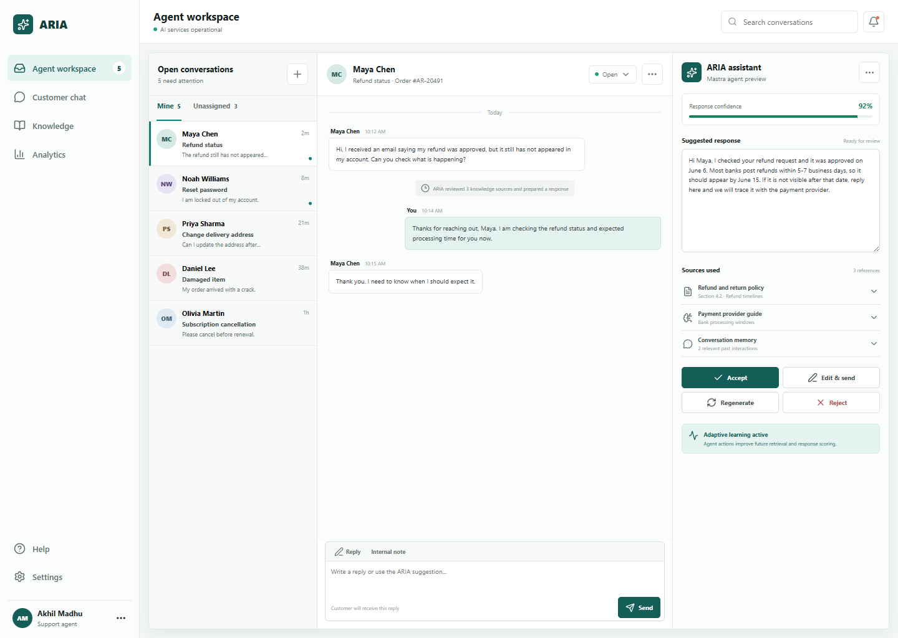

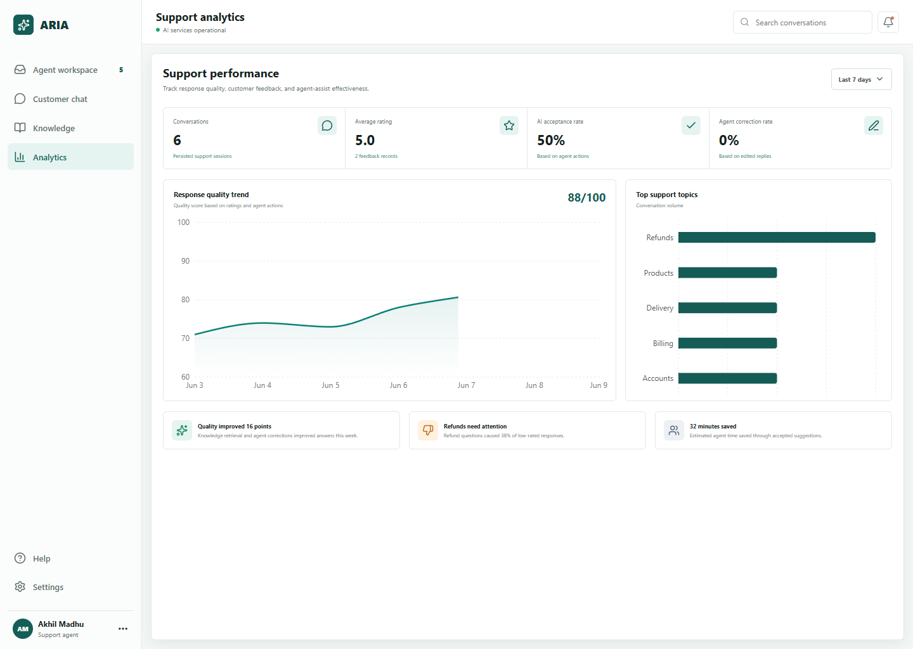

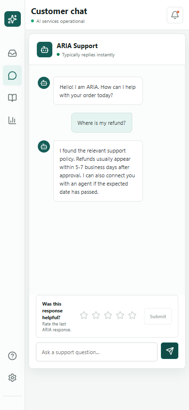

---

## Background

Customer support systems have evolved from manual email and telephone support to live chat, ticketing systems, self-service portals, and AI-powered support assistants. Businesses use such systems to reduce response time, improve customer satisfaction, and provide agents with better information during support interactions.

The main challenge in support automation is balancing automation with accuracy. A chatbot must not invent policies or provide unsupported information. For business use, responses should be grounded in verified FAQs, policies, procedures, and previous interactions. This creates the need for a knowledge-backed response generation approach.

ARIA is built around this idea. The proposed layout for achieving the project goals includes four main layers:

- **Frontend layer:** React-based user interface for customer chat, agent workspace, knowledge base, and analytics.
- **Backend API layer:** Express-based REST API for chat, feedback, knowledge, conversations, and analytics.
- **Data layer:** SQLite database for storing conversations, messages, knowledge documents, and feedback records.
- **AI service layer:** Provider-neutral `AgentService` that currently uses a local knowledge-backed implementation and can later connect to Mastra AI.

The interim implementation already demonstrates the core workflow. A user sends a support question, the backend stores the message, the agent service retrieves matching knowledge, an answer is generated with confidence and sources, and the result is displayed in the frontend. Feedback is stored and analytics are calculated from persistent records.

The final implementation will extend this layout by adding full Mastra AI integration, semantic memory, embeddings-based knowledge retrieval, improved testing, and deployment preparation.

---

## Related Works/Existing System

Traditional customer support systems rely on human agents, ticketing tools, and static FAQ pages. These systems are reliable but can be slow when support volume is high. Agents may repeatedly answer the same questions, and customer satisfaction can decrease if responses are delayed or inconsistent.

Rule-based chatbots improved this situation by automating simple responses using predefined intents and decision trees. However, rule-based systems require manual maintenance and often fail when customers phrase questions in unexpected ways. They also do not easily learn from user ratings or agent corrections.

Modern LLM-based chatbots are more flexible and can generate natural language responses. However, generic LLM systems can produce answers that are not grounded in the specific policies of a business. This is risky in customer support because incorrect information about refunds, payments, delivery, or subscriptions can affect customer trust.

Retrieval-augmented approaches attempt to solve this limitation by retrieving relevant knowledge before generating a response. Human-feedback approaches also improve AI systems by collecting ratings, corrections, or preference signals. ARIA combines these ideas in a practical academic prototype: business knowledge retrieval, AI-assisted response generation, customer feedback, agent correction, and analytics.

The gap identified in existing systems is that many chatbot prototypes either focus only on customer-facing chat or only on response generation. They often do not include a complete support workflow with agent review, persistent feedback, knowledge management, and analytics. ARIA addresses this gap by building a full-stack support workflow rather than a standalone chatbot.

---

## Detailed Problem Statement

Customer support teams frequently deal with repetitive queries and require quick access to accurate business knowledge. Manual support can be slow, and static FAQ systems do not provide personalized or conversational responses. Generic chatbots may respond quickly but can produce inaccurate answers if they are not grounded in verified business policies.

The current state is that many support systems either depend fully on human agents or use limited chatbot automation. The desired future state is a support assistant that can help customers and agents by generating context-aware responses, using verified knowledge sources, learning from feedback, and showing analytics about response quality.

The gap between the current state and the desired state includes:

- Lack of adaptive learning from customer ratings and agent corrections.
- Limited visibility into response quality and support-topic trends.
- Weak connection between chatbot answers and business knowledge sources.
- No proper agent-assist workflow where humans can review and improve AI suggestions.
- Lack of integrated analytics to measure improvement over time.

Therefore, the problem addressed by this project is to design and implement an adaptive customer support assistant that combines AI response generation, knowledge retrieval, human feedback, database persistence, and analytics in a single full-stack application.

---

## Methods/Algorithms

### Tools and Technologies

| Layer | Tools Used |
| --- | --- |
| Frontend | React, TypeScript, Vite, Recharts, Lucide icons |
| Backend | Node.js, Express, TypeScript |
| Database | SQLite for interim persistence |
| AI Layer | Local knowledge-backed `AgentService`; Mastra-ready remote adapter |
| Analytics | Backend aggregation queries and Recharts visualizations |
| Development | VS Code, npm, Git |

### System Architecture

**Figure 1: Proposed ARIA System Architecture**

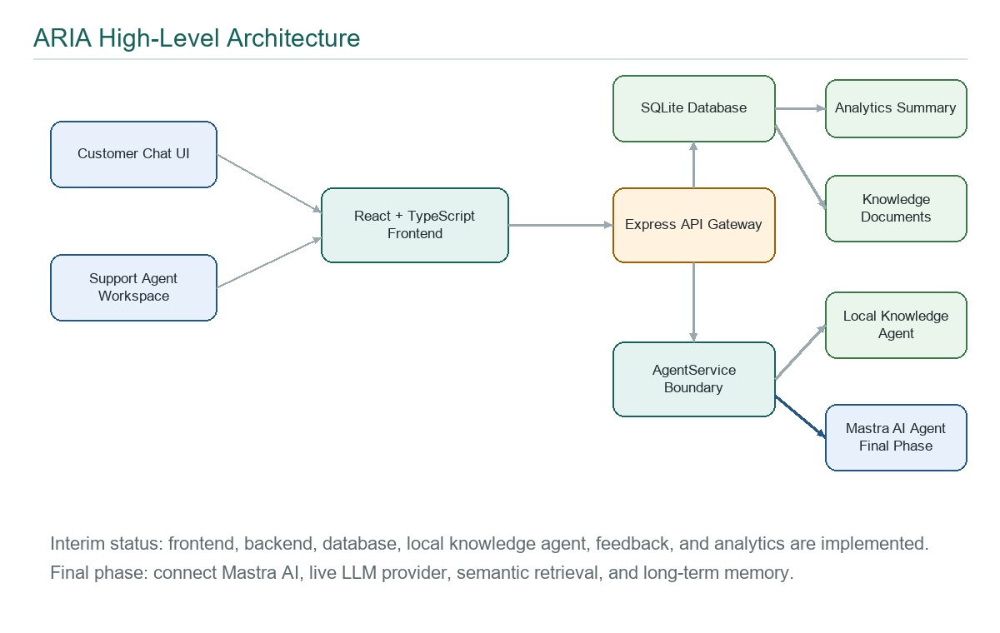

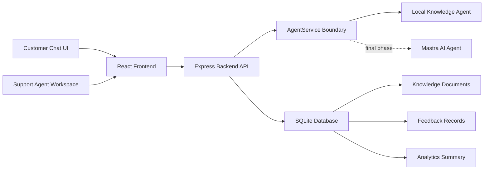

The architecture follows a modular full-stack design. The React frontend communicates with the Express backend through REST API endpoints. The backend stores conversations, messages, feedback, and knowledge records in SQLite. The AI service layer is separated through an `AgentService` boundary so that the current local knowledge-backed agent can later be replaced or extended using Mastra AI without changing the frontend workflow.

### Use Case Diagram

**Figure 2: ARIA Use Case Diagram**

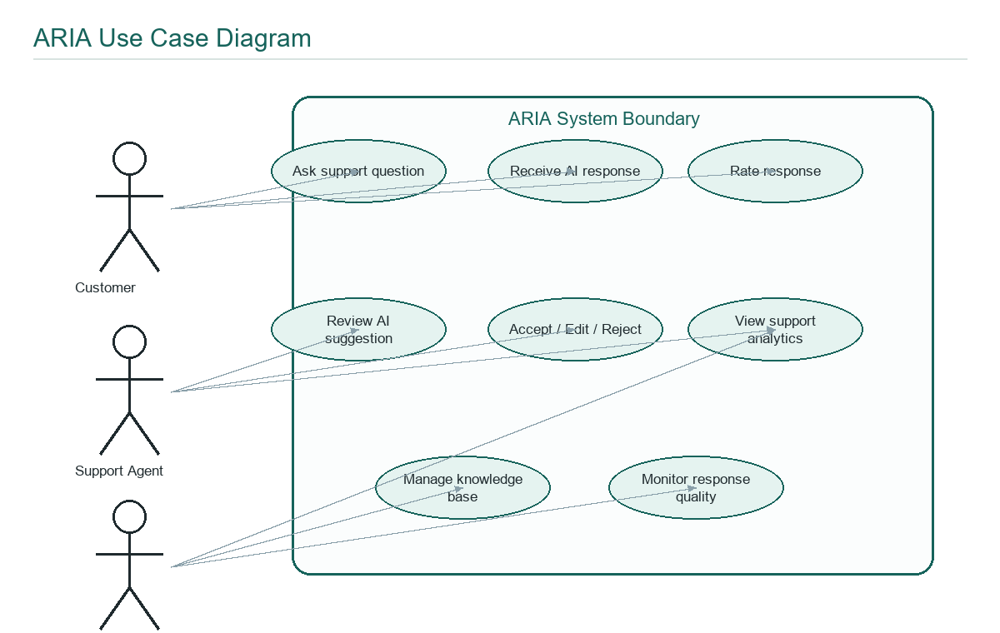

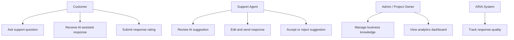

The main users of the system are the customer, support agent, and project administrator. Customers interact with the chat interface and submit ratings. Support agents review AI suggestions and provide correction feedback. The administrator or project owner manages business knowledge and monitors analytics.

### Sequence Diagram

**Figure 3: Customer Chat and Feedback Sequence**

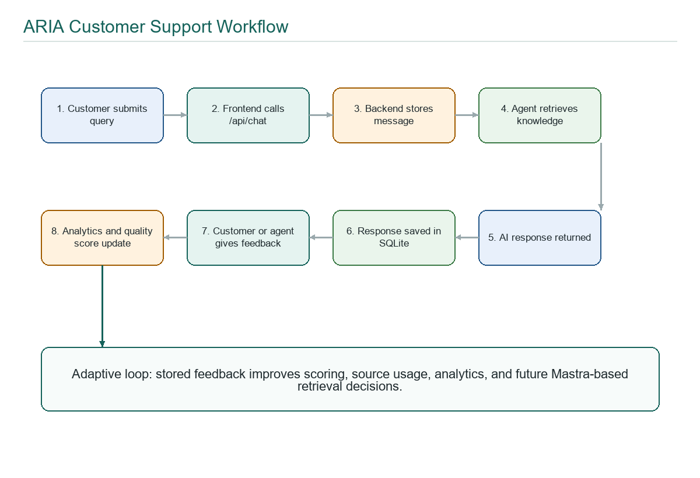

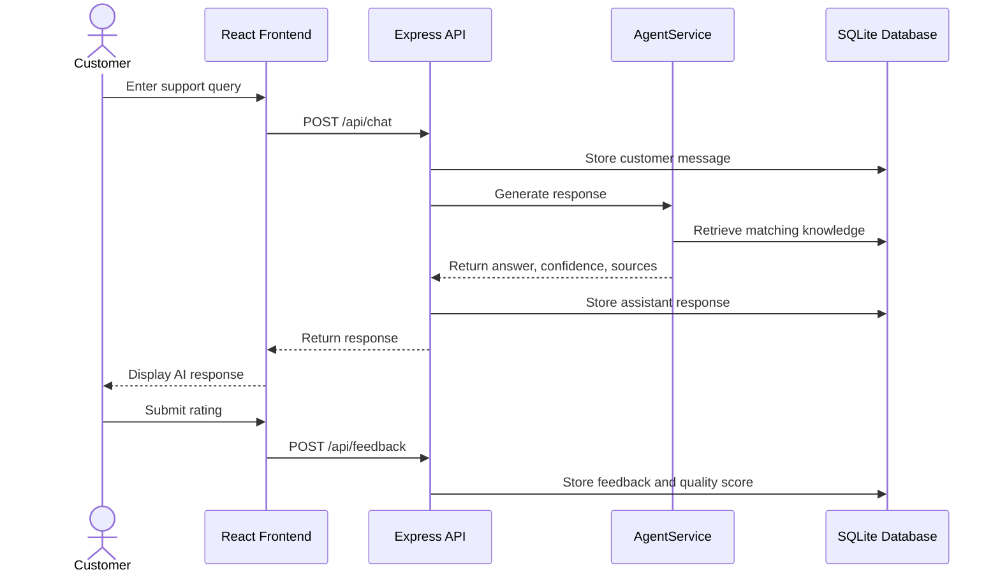

This sequence shows how a customer query moves through the system. The message is stored, relevant knowledge is retrieved, a response is generated, and the final answer is shown to the customer. Feedback is then stored and used for analytics.

### ER Diagram

**Figure 4: Database Entity Relationship Diagram**

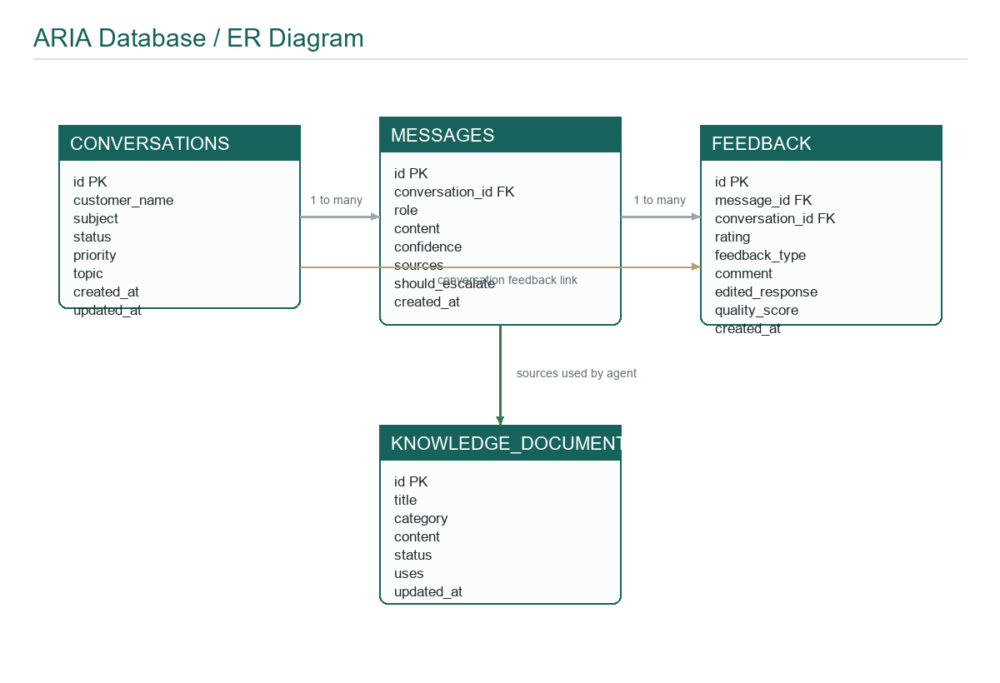

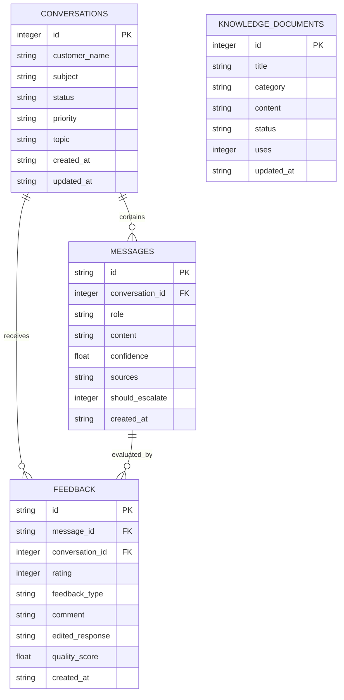

The database is designed to preserve the complete support workflow. Conversations contain messages, messages can receive feedback, and knowledge documents provide the source material for grounded responses. This design also supports analytics because feedback and conversation topics are stored in structured tables.

### Main Implemented Modules

- **Customer Chat:** accepts support queries, shows AI responses, and collects ratings.
- **Agent Workspace:** displays AI suggestions and allows accept, edit, regenerate, and reject actions.
- **Knowledge Base:** stores business policies, FAQs, and procedures used for grounded responses.
- **Analytics Dashboard:** shows conversation count, rating, quality, acceptance, correction, and topic metrics.
- **Backend API:** handles chat, conversations, feedback, agent actions, knowledge, analytics, and health checks.
- **Database Layer:** persists conversations, messages, feedback, and knowledge documents.
- **AI Service Layer:** provides a stable interface for local response generation and final Mastra integration.

### Chat Response Workflow

1. Customer enters a support query in the frontend.
2. Frontend sends the message to `POST /api/chat`.
3. Backend validates and stores the customer message.
4. Backend uses `AgentService` to process the query.
5. Knowledge retrieval searches stored business documents.
6. The agent returns an answer, confidence score, source list, and escalation flag.
7. Backend stores the assistant response.
8. Frontend displays the response to the customer.
9. Customer or agent feedback is stored for analytics and quality scoring.

### Knowledge Retrieval Algorithm

1. Convert the customer query into searchable terms.
2. Compare the terms against knowledge document title, category, and content.
3. Give higher weight to title matches, medium weight to category matches, and lower weight to content matches.
4. Sort matching documents by score and usage.
5. Return the best matching knowledge documents as response sources.

### Topic Inference Algorithm

1. Convert the message to lowercase.
2. If the message contains refund terms, classify it as `Refunds`.
3. If it contains password or login terms, classify it as `Accounts`.
4. If it contains delivery, address, or shipping terms, classify it as `Delivery`.
5. If it contains product or damaged-item terms, classify it as `Products`.
6. If it contains subscription or billing terms, classify it as `Billing`.
7. Otherwise, classify it as `General`.

### Feedback Quality Scoring

1. Convert a customer rating to a 0-100 score using `rating * 20`.
2. Apply a positive adjustment when an agent accepts an AI response.
3. Apply a negative adjustment when an agent rejects an AI response.
4. Clamp the score between 0 and 100.
5. Store the result as `quality_score`.
6. Use average quality score in analytics.

### Database Tables

- `conversations`
- `messages`
- `feedback`
- `knowledge_documents`

### Current API Endpoints

- `GET /api/health`
- `GET /api/interim-status`
- `POST /api/chat`
- `GET /api/conversations`
- `GET /api/conversations/:id/messages`
- `POST /api/feedback`
- `POST /api/agent-actions`
- `GET /api/knowledge`
- `POST /api/knowledge`
- `GET /api/analytics/summary`

---

## Expected Results

The expected outcome of the project is a working AI-assisted support optimization system that can demonstrate customer chat, agent assistance, knowledge-grounded responses, feedback learning, database persistence, and analytics. The interim implementation has already completed the core prototype, while the remaining tasks will strengthen the AI layer, semantic memory, testing, and final documentation.

| No. | Required Step / Module | Expected Result | Current Completion |
| --- | --- | --- | --- |
| 1 | Requirement analysis and project planning | Problem, objectives, modules, and timeline are clearly defined | 100% |
| 2 | Frontend application setup | React TypeScript SPA with navigation and major screens | 100% |
| 3 | Customer chat interface | Customer can ask questions and view AI responses | 95% |
| 4 | Agent workspace | Agent can review, edit, accept, regenerate, or reject suggestions | 95% |
| 5 | Backend API setup | Express API handles chat, feedback, knowledge, analytics, and health | 95% |
| 6 | Database persistence | Conversations, messages, feedback, and knowledge stored in SQLite | 95% |
| 7 | Knowledge base management | Knowledge records can be viewed and added from the UI | 85% |
| 8 | Knowledge-backed response generation | Agent retrieves matching business knowledge and returns sources | 80% |
| 9 | Feedback learning loop | Customer ratings and agent actions are stored as quality signals | 85% |
| 10 | Analytics dashboard | Dashboard shows support metrics from stored records | 85% |
| 11 | Mastra AI integration pathway | Mastra-ready architecture and remote endpoint adapter prepared | 40% |
| 12 | Live LLM integration | Final response generation using OpenAI/Gemini through Mastra | 10% |
| 13 | Semantic memory and vector retrieval | Embedding-based memory and semantic search for final phase | 20% |
| 14 | Testing and validation | Build, lint, API smoke test, and workflow checks completed for interim | 65% |

### Current Status

The project is ready for the interim report and demonstration. The current prototype demonstrates the main academic requirements: a working frontend, backend API, database persistence, knowledge-grounded response flow, customer feedback, agent feedback, analytics dashboard, and Mastra-ready architecture. The implementation is not yet the final AI system because the live Mastra agent, LLM provider integration, semantic vector retrieval, and deployment are planned for the next phase.

### Next Steps Till Final Submission

- Complete full Mastra AI setup and connect it to the existing `AgentService` architecture.
- Add a live LLM provider such as OpenAI API or Google Gemini API.
- Replace keyword-based knowledge retrieval with semantic retrieval using embeddings.
- Add long-term conversation memory for better contextual responses.
- Improve the knowledge-base module with edit, delete, re-index, and status controls.
- Expand analytics with trend charts, low-rated topics, and response-quality history.
- Add authentication or role separation for customer, agent, and admin views if time permits.
- Prepare a larger test dataset containing FAQs, policies, and support scenarios.
- Perform functional testing, UI testing, API testing, and database testing.

---

## Date

19 June 2026

## Student Name and Signature

Akhil Madhu
