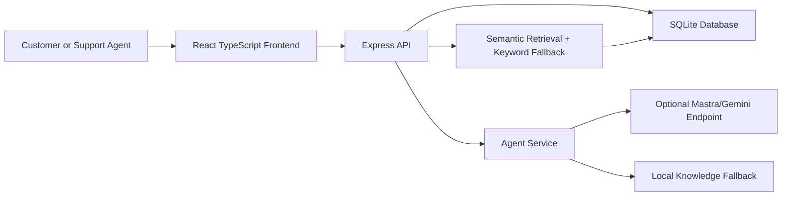

# ARIA API Reference

This document describes the backend API used by the ARIA frontend, final validation scripts, and demo workflow.

## Base URLs

Local backend:

```text
http://localhost:8787/api
```

Frontend API client default:

```text
VITE_API_URL=http://localhost:8787/api
```

The frontend talks only to the Express API. AI provider keys, SQLite access, retrieval logic, Mastra routing, and feedback learning remain on the backend side.

## Architecture Position



## Endpoint Summary

| Method | Endpoint | Purpose | Used By |
| --- | --- | --- | --- |
| GET | `/health` | Checks API, SQLite, retrieval, Mastra, and provider-key status. | Setup checks, final validation |
| GET | `/system-status` | Returns live system, database, retrieval, AI, and learning-loop status for the Settings modal. | Settings modal, demo proof |
| GET | `/interim-status` | Returns interim milestone readiness and final pending items. | Report/demo evidence |
| POST | `/chat` | Creates or continues a conversation and generates an assistant response. | Customer Chat |
| GET | `/conversations` | Lists persisted support conversations. | Agent Workspace |
| GET | `/conversations/:id/messages` | Lists messages for one conversation. | Agent Workspace |
| POST | `/feedback` | Stores customer rating or feedback for an assistant message. | Customer Chat, learning loop |
| POST | `/agent-actions` | Stores agent accept, edit, or reject actions as quality feedback. | Agent Workspace |
| GET | `/knowledge` | Lists support knowledge records. | Knowledge Base, retrieval |
| POST | `/knowledge` | Adds a new support knowledge record. | Knowledge Base |
| GET | `/analytics/summary` | Returns persisted learning and support metrics. | Analytics Dashboard |

## Common Response Behavior

Successful responses return JSON. Validation failures return `400 Bad Request` with an `error` field. Duplicate knowledge titles return `409 Conflict`.

Example error:

```json
{
  "error": "message is required"
}
```

The prototype does not require login authentication. This is acceptable for the current local academic demo. For deployment, authentication can be added as a future enhancement before exposing agent or knowledge-management features publicly.

## GET /health

Checks whether the backend is running and reports current AI, database, and retrieval configuration.

Example:

```powershell
curl http://localhost:8787/api/health
```

Response fields:

| Field | Meaning |
| --- | --- |
| `service` | Backend service name. |
| `status` | API status, expected as `operational`. |
| `agentProvider` | Active response path, such as local fallback or Mastra remote. |
| `database` | Database engine, currently `sqlite`. |
| `mastraReady` | Whether the backend has Mastra-ready integration points. |
| `mastraServerEnabled` | Whether the local Mastra Express adapter is enabled. |
| `mastraModel` | Configured model name. |
| `llmProvider` | Configured provider preference. |
| `llmProviderConfigured` | Whether the selected provider key is present locally. |
| `retrieval` | Semantic retrieval metadata and embedding status. |

Example response:

```json
{
  "service": "ARIA API",
  "status": "operational",
  "agentProvider": "local-knowledge",
  "database": "sqlite",
  "mastraReady": true,
  "mastraServerEnabled": false,
  "mastraModel": "google/gemini-2.5-flash",
  "llmProvider": "google-gemini",
  "llmProviderConfigured": true,
  "retrieval": {
    "primary": "semantic",
    "fallback": "keyword",
    "embeddingModel": "Xenova/all-MiniLM-L6-v2",
    "storedEmbeddings": 10,
    "dimensions": 384
  }
}
```

## GET /system-status

Returns a consolidated read-only status snapshot used by the Settings modal. This endpoint is useful during demo and viva because it proves the frontend is not showing only static text; it is reading live backend, database, retrieval, AI, and learning-loop status.

Example:

```powershell
curl http://localhost:8787/api/system-status
```

Response fields:

| Field | Meaning |
| --- | --- |
| `generatedAt` | Timestamp when the status snapshot was created. |
| `backend` | API service name, operational state, and local API base URL. |
| `database` | SQLite engine status, conversation count, feedback count, and knowledge count. |
| `retrieval` | Semantic retrieval mode, fallback mode, embedding model, stored embedding count, and vector dimensions. |
| `ai` | Active agent provider, Mastra readiness, configured model, provider name, and whether the provider key exists. |
| `learning` | Number of tracked knowledge sources and sources affected by feedback learning. |

Example response:

```json
{
  "generatedAt": "2026-07-09T16:20:00.121Z",
  "backend": {
    "service": "ARIA API",
    "status": "operational",
    "apiBase": "http://127.0.0.1:8787/api"
  },
  "database": {
    "engine": "sqlite",
    "status": "active",
    "conversations": 124,
    "feedbackRecords": 60,
    "knowledgeRecords": 10,
    "indexedKnowledgeRecords": 10
  },
  "retrieval": {
    "primary": "semantic",
    "fallback": "keyword",
    "embeddingModel": "Xenova/all-MiniLM-L6-v2",
    "storedEmbeddings": 10,
    "dimensions": 384
  },
  "ai": {
    "agentProvider": "mastra-remote",
    "mastraReady": true,
    "mastraServerEnabled": false,
    "model": "google/gemini-2.5-flash",
    "llmProvider": "google-gemini",
    "providerConfigured": true
  },
  "learning": {
    "trackedSources": 3,
    "learnedSources": 3
  }
}
```

Security behavior:

- The endpoint does not expose API keys.
- It only reports whether a provider key is configured.
- It is safe to show during demo because it proves integration without leaking secrets.

## GET /interim-status

Returns milestone status text that can be used as project evidence for interim or final reporting.

Example:

```powershell
curl http://localhost:8787/api/interim-status
```

Main response fields:

| Field | Meaning |
| --- | --- |
| `milestone` | Current milestone label. |
| `readyForDemo` | Whether the local milestone demo is ready. |
| `completed` | Completed implementation points. |
| `pendingForFinal` | Remaining final-phase work. |

## POST /chat

Generates a grounded assistant response. If no `conversationId` is supplied, the backend creates a new conversation. The request and assistant response are saved in SQLite.

Request body:

```json
{
  "message": "How long does a refund take?",
  "conversationId": 12
}
```

Required fields:

| Field | Type | Required | Notes |
| --- | --- | --- | --- |
| `message` | string | Yes | Customer question. Empty messages return `400`. |
| `conversationId` | number | No | Existing conversation id. If absent, a new conversation is created. |

Example:

```powershell
curl -X POST http://localhost:8787/api/chat `
  -H "Content-Type: application/json" `
  -d "{\"message\":\"How long does a refund take?\"}"
```

Response:

```json
{
  "id": "assistant-message-id",
  "conversationId": 12,
  "role": "assistant",
  "createdAt": "2026-06-29T10:00:00.000Z",
  "answer": "Refunds are usually processed within 5-7 business days...",
  "confidence": 0.94,
  "sources": ["Refund and return policy"],
  "sourceScores": [
    {
      "title": "Refund and return policy",
      "score": 0.61,
      "semanticScore": 0.59,
      "feedbackAdjustment": 0.02,
      "feedbackCount": 6,
      "averageQuality": 92
    }
  ],
  "retrievalMethod": "semantic",
  "generationProvider": "local-knowledge",
  "shouldEscalate": false
}
```

Important behavior:

- Stores the customer message and assistant response in `messages`.
- Creates a conversation automatically when needed.
- Updates the conversation topic using simple topic inference.
- Increments usage count for matched knowledge sources.
- Uses semantic retrieval first and keyword retrieval as fallback.
- Uses Mastra/Gemini when configured, otherwise keeps the demo stable with local knowledge fallback.
- Returns `shouldEscalate: true` for unrelated questions where no reliable support source is found.

## GET /conversations

Lists stored conversations in latest-updated order.

Example:

```powershell
curl http://localhost:8787/api/conversations
```

Response item:

```json
{
  "id": 12,
  "customer": "Demo Customer",
  "subject": "How long does a refund take?",
  "status": "open",
  "priority": "normal",
  "topic": "Refunds",
  "createdAt": "2026-06-29T10:00:00.000Z",
  "updatedAt": "2026-06-29T10:01:00.000Z"
}
```

## GET /conversations/:id/messages

Lists all messages for one conversation in chronological order.

Example:

```powershell
curl http://localhost:8787/api/conversations/12/messages
```

Response item:

```json
{
  "id": "assistant-message-id",
  "conversationId": 12,
  "role": "assistant",
  "content": "Refunds are usually processed within 5-7 business days...",
  "confidence": 0.94,
  "sources": ["Refund and return policy"],
  "sourceScores": [],
  "retrievalMethod": "semantic",
  "generationProvider": "local-knowledge",
  "shouldEscalate": false,
  "createdAt": "2026-06-29T10:01:00.000Z"
}
```

## POST /feedback

Stores customer feedback for a generated assistant message.

Request body:

```json
{
  "messageId": "assistant-message-id",
  "conversationId": 12,
  "rating": 5,
  "feedbackType": "customer_rating",
  "comment": "Helpful response"
}
```

Required fields:

| Field | Type | Required | Notes |
| --- | --- | --- | --- |
| `messageId` | string | Yes | Assistant message being rated. |
| `conversationId` | number | Yes | Conversation connected to the message. |
| `rating` | number | No | Customer rating. The UI sends star ratings. |
| `feedbackType` | string | No | Defaults to `customer_rating`. |
| `comment` | string | No | Optional text feedback. |
| `editedResponse` | string | No | Optional correction text. |

Response:

```json
{
  "id": "feedback-id",
  "messageId": "assistant-message-id",
  "conversationId": 12,
  "rating": 5,
  "feedbackType": "customer_rating",
  "comment": "Helpful response",
  "editedResponse": null,
  "qualityScore": 100,
  "createdAt": "2026-06-29T10:02:00.000Z"
}
```

Learning-loop effect:

- Feedback is persisted in SQLite.
- Analytics uses it for average rating, average quality, and feedback count.
- Source-quality statistics use it to adjust close semantic matches safely.

## POST /agent-actions

Stores support-agent actions on AI suggestions. This is how accept, edit, and reject actions become part of the feedback learning loop.

Request body:

```json
{
  "conversationId": 12,
  "action": "accepted",
  "editedResponse": "Optional corrected answer"
}
```

Allowed `action` values:

| Action | Meaning |
| --- | --- |
| `accepted` | Agent accepted the AI suggestion. |
| `edited` | Agent corrected the AI suggestion. |
| `rejected` | Agent rejected the AI suggestion. |

Response:

```json
{
  "id": "feedback-id",
  "messageId": "assistant-message-id",
  "conversationId": 12,
  "feedbackType": "accepted",
  "editedResponse": null,
  "qualityScore": 95,
  "createdAt": "2026-06-29T10:03:00.000Z"
}
```

Validation:

- `conversationId` is required.
- `action` must be one of `accepted`, `edited`, or `rejected`.
- If the conversation has no assistant message yet, the backend creates a placeholder assistant suggestion so the action can still be recorded.

## GET /knowledge

Lists all knowledge documents used for support grounding and retrieval.

Example:

```powershell
curl http://localhost:8787/api/knowledge
```

Response item:

```json
{
  "id": 1,
  "title": "Refund and return policy",
  "category": "Refunds",
  "content": "Customers can request a refund...",
  "status": "indexed",
  "uses": 14,
  "updatedAt": "2026-06-29T10:00:00.000Z"
}
```

## POST /knowledge

Adds a new support knowledge document.

Request body:

```json
{
  "title": "Delivery address change",
  "category": "Delivery",
  "content": "Customers can change the delivery address before dispatch...",
  "status": "indexed"
}
```

Required fields:

| Field | Type | Required | Notes |
| --- | --- | --- | --- |
| `title` | string | Yes | Must be unique. |
| `category` | string | Yes | Support topic category. |
| `content` | string | Yes | Grounding text used by retrieval. |
| `status` | string | No | Must be `indexed` or `review`. Defaults to `indexed`. |

Responses:

| Status | Meaning |
| --- | --- |
| `201 Created` | Knowledge record was created. |
| `400 Bad Request` | Missing title, category, content, or invalid status. |
| `409 Conflict` | A document with the same title already exists. |

After adding or changing knowledge content, run:

```powershell
npm run index:knowledge
```

This refreshes semantic embeddings for retrieval.

## GET /analytics/summary

Returns persisted support metrics, learning-loop metrics, topic counts, and source-quality summaries.

Example:

```powershell
curl http://localhost:8787/api/analytics/summary
```

Response:

```json
{
  "conversations": 79,
  "averageRating": 5.0,
  "averageQuality": 89,
  "acceptanceRate": 52,
  "correctionRate": 12,
  "feedbackRecords": 17,
  "topics": [
    {
      "topic": "General",
      "conversations": 20
    }
  ],
  "learningSignals": {
    "learnedSourceCount": 3,
    "trackedSourceCount": 10,
    "agentActionCount": 9,
    "averageSourceQuality": 89
  },
  "strongestSources": [
    {
      "title": "Refund and return policy",
      "feedbackCount": 6,
      "averageQuality": 92,
      "averageRating": 5.0,
      "acceptedCount": 2,
      "editedCount": 0,
      "rejectedCount": 0,
      "feedbackAdjustment": 0.0113
    }
  ],
  "reviewSources": []
}
```

## Environment Variables

| Variable | Required | Purpose |
| --- | --- | --- |
| `PORT` | No | Backend port. Defaults to `8787`. |
| `VITE_API_URL` | No | Frontend API base URL. Defaults to `http://localhost:8787/api`. |
| `ENABLE_MASTRA_SERVER` | No | Enables the local Mastra Express adapter when set to `true`. |
| `MASTRA_AGENT_URL` | No | Routes chat generation through a Mastra-compatible endpoint. |
| `MASTRA_MODEL` | No | Model name used by Mastra/Gemini setup. |
| `LLM_PROVIDER` | No | Provider preference, such as `google-gemini` or `openai`. |
| `GOOGLE_GENERATIVE_AI_API_KEY` | No | Gemini key for live generation. Keep only in `.env`. |
| `GOOGLE_API_KEY` | No | Supported Gemini key alias. Keep only in `.env`. |
| `OPENAI_API_KEY` | No | Optional OpenAI provider key. Keep only in `.env`. |
| `VALIDATION_API_URL` | No | API URL used by the validation script. |

## Endpoint Verification Checklist

Use this table before the final demo to confirm that each backend area is working. The same table can also help answer viva questions about testing and validation.

| Step | Endpoint or Command | Expected Result | What It Proves |
| --- | --- | --- | --- |
| 1 | `GET /health` | `status` is `operational`, database is `sqlite`, retrieval is `semantic`. | Backend, SQLite connection, and retrieval metadata are active. |
| 2 | `GET /system-status` | Shows backend, database, retrieval, AI, and learning fields. | Settings modal uses live backend status instead of static content. |
| 3 | `GET /knowledge` | Returns the seeded support knowledge records. | Knowledge base persistence and retrieval source data are available. |
| 4 | `POST /chat` with a refund, product, billing, or delivery question. | Returns an answer, confidence score, source list, source scores, and `retrievalMethod`. | Customer chat, semantic retrieval, source grounding, and AI response generation work together. |
| 5 | `POST /chat` with an unrelated question. | Returns safe escalation with `retrievalMethod: "none"` and `shouldEscalate: true`. | The system avoids unsupported hallucinated answers. |
| 6 | `POST /feedback` after a chat response. | Creates a feedback record with a quality score. | Customer rating feedback is persisted. |
| 7 | `POST /agent-actions` with `accepted`, `edited`, or `rejected`. | Creates an agent-action feedback record. | Agent review decisions are stored as learning signals. |
| 8 | `GET /analytics/summary` | Shows conversations, feedback records, learning signals, source quality, and topics. | Dashboard metrics are calculated from persisted records. |
| 9 | `npm run evaluate:retrieval` | All retrieval prompts pass. | Semantic retrieval returns correct business sources and rejects unrelated prompts. |
| 10 | `npm run evaluate:adaptation` | All adaptation checks pass. | Feedback learning improves source ranking without unsafe behavior. |
| 11 | `npm run validate:final` | All final validation checks pass. | End-to-end API, persistence, retrieval, feedback, and analytics are verified. |

## Demo Explanation Points

- The frontend never calls Gemini or SQLite directly; it calls the Express API.
- The Express API owns persistence, retrieval, feedback learning, and Mastra routing.
- SQLite stores conversations, messages, feedback, and knowledge records.
- Semantic retrieval finds the most relevant business knowledge before answering.
- The response includes source evidence, confidence, retrieval method, and generation provider.
- Customer ratings and agent actions are converted into quality signals.
- Analytics is calculated from stored records, not hard-coded dashboard values.
- The Settings modal reads `/system-status` to prove live backend integration.
- Mastra Cloud is used as the deployed agent layer, with Gemini as the configured model provider.
- The local fallback keeps the demo stable if provider quota or network access is unavailable.

## Final Demo Validation

Start the app:

```powershell
npm run dev
```

In a second terminal, run:

```powershell
npm run validate:final
npm run evaluate:retrieval
npm run evaluate:adaptation
```

Expected validation coverage:

- API health and SQLite status.
- Semantic retrieval metadata.
- Knowledge records.
- Grounded chat response.
- Source evidence and retrieval method.
- Customer feedback storage.
- Agent action storage.
- Unrelated-query escalation.
- Analytics learning summary.
- Retrieval regression and adaptation safety checks.

## Security Notes

- Do not expose API keys in frontend code.
- Do not commit `.env`, SQLite database files, model cache files, or build output.
- Keep provider keys only in local environment variables or deployment secrets.
- Add authentication before using this API outside a controlled academic demo environment.
- Keep the local fallback enabled so the demo works even if the live provider quota is exhausted.
