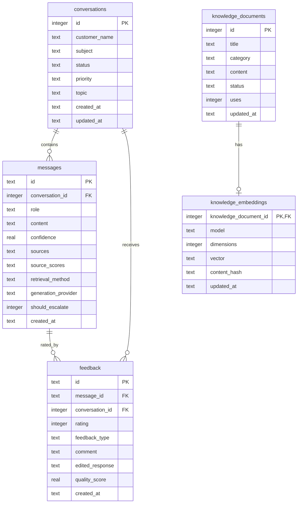
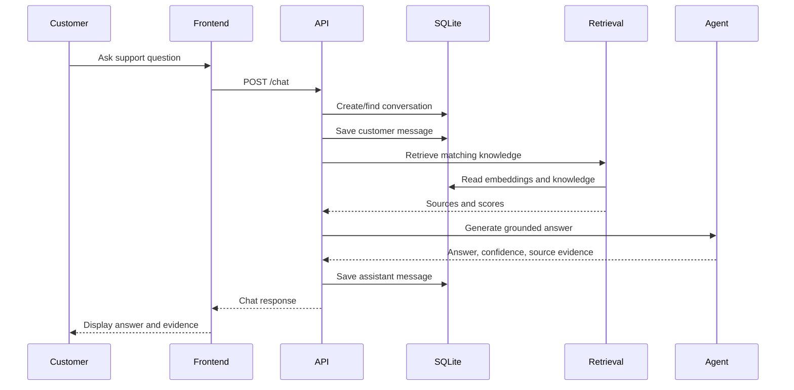
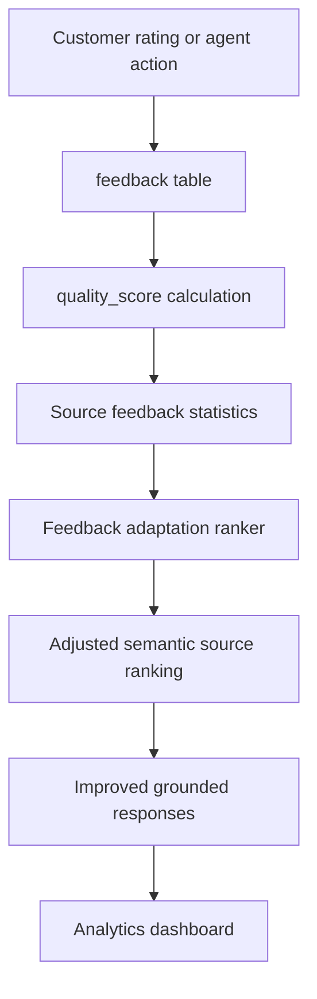

# ARIA Database Schema

ARIA uses SQLite for local persistence during development, demo, validation, and final project evaluation. The database file is created automatically at:

```text
aria-app/data/aria.db
```

The application uses Node.js built-in SQLite support through `node:sqlite`. No MongoDB setup is required for the current project scope.

## Database Role

SQLite stores:

- support conversations
- customer and assistant messages
- customer feedback
- agent accept/edit/reject actions
- support knowledge records
- semantic embedding vectors
- source-quality learning signals

## Entity Relationship Diagram



## Table Summary

| Table | Purpose | Main UI/API Usage |
| --- | --- | --- |
| `conversations` | Stores each customer support case. | Agent Workspace, Customer Chat, Analytics |
| `messages` | Stores customer messages and AI assistant responses. | Chat history, source evidence, validation |
| `feedback` | Stores ratings and agent actions. | Feedback learning loop, Analytics |
| `knowledge_documents` | Stores policy, FAQ, and procedure records used for grounding. | Knowledge Base, response retrieval |
| `knowledge_embeddings` | Stores semantic vectors for indexed knowledge records. | Semantic retrieval |

## conversations

Stores one record per support conversation.

| Column | Type | Constraint/Default | Meaning |
| --- | --- | --- | --- |
| `id` | INTEGER | Primary key, autoincrement | Conversation id. |
| `customer_name` | TEXT | Required | Customer name shown in the agent workspace. |
| `subject` | TEXT | Required | Short subject generated from the first customer question or seeded data. |
| `status` | TEXT | Default `open` | Conversation status. |
| `priority` | TEXT | Default `normal` | Support priority. |
| `topic` | TEXT | Default `General` | Inferred topic such as Refunds, Accounts, Delivery, Products, Billing, or General. |
| `created_at` | TEXT | Required | ISO timestamp. |
| `updated_at` | TEXT | Required | ISO timestamp updated when chat continues. |

Created by:

- seed data during first run
- `POST /api/chat` when no `conversationId` is supplied

Read by:

- `GET /api/conversations`
- `GET /api/analytics/summary`

## messages

Stores customer messages and assistant responses.

| Column | Type | Constraint/Default | Meaning |
| --- | --- | --- | --- |
| `id` | TEXT | Primary key | UUID for each message. |
| `conversation_id` | INTEGER | Foreign key to `conversations.id` | Parent conversation. |
| `role` | TEXT | Required | `customer` or `assistant`. |
| `content` | TEXT | Required | Message text. |
| `confidence` | REAL | Optional | Assistant response confidence. |
| `sources` | TEXT | Optional JSON | Knowledge source titles used by the response. |
| `source_scores` | TEXT | Optional JSON | Semantic score, adjusted score, and learning metadata. |
| `retrieval_method` | TEXT | Optional | `semantic`, `keyword`, or `none`. |
| `generation_provider` | TEXT | Optional | `mastra-gemini` or `local-knowledge`. |
| `should_escalate` | INTEGER | Default `0` | Boolean flag stored as 0/1. |
| `created_at` | TEXT | Required | ISO timestamp. |

Created by:

- customer messages in `POST /api/chat`
- assistant responses in `POST /api/chat`
- fallback placeholder assistant message in `POST /api/agent-actions` if an action is recorded before a generated answer exists

Read by:

- `GET /api/conversations/:id/messages`
- `GET /api/analytics/summary`
- feedback source-quality calculations

## feedback

Stores customer ratings and support-agent actions.

| Column | Type | Constraint/Default | Meaning |
| --- | --- | --- | --- |
| `id` | TEXT | Primary key | UUID for the feedback record. |
| `message_id` | TEXT | Foreign key to `messages.id` | Message being rated or acted on. |
| `conversation_id` | INTEGER | Foreign key to `conversations.id` | Parent conversation. |
| `rating` | INTEGER | Optional | Customer star rating. |
| `feedback_type` | TEXT | Default `customer_rating` | `customer_rating`, `accepted`, `edited`, or `rejected`. |
| `comment` | TEXT | Optional | Customer or reviewer comment. |
| `edited_response` | TEXT | Optional | Corrected answer when agent edits a suggestion. |
| `quality_score` | REAL | Required | Normalized quality score from 0 to 100. |
| `created_at` | TEXT | Required | ISO timestamp. |

Created by:

- `POST /api/feedback`
- `POST /api/agent-actions`

Used for:

- average rating
- average quality
- acceptance rate
- correction rate
- review-needed source detection
- feedback-based retrieval adaptation

Quality score logic:

```text
rating score = rating * 20
accepted action = +15 adjustment
rejected action = -20 adjustment
final score is clamped between 0 and 100
```

If no rating exists, the neutral base score is `60`.

## knowledge_documents

Stores support knowledge used to ground AI responses.

| Column | Type | Constraint/Default | Meaning |
| --- | --- | --- | --- |
| `id` | INTEGER | Primary key, autoincrement | Knowledge record id. |
| `title` | TEXT | Required, unique | Knowledge source title shown in evidence chips. |
| `category` | TEXT | Required | Policy, Procedure, FAQ, or related category. |
| `content` | TEXT | Required | Grounding text used by retrieval and AI response generation. |
| `status` | TEXT | Default `indexed` | `indexed` records are used for retrieval; `review` records need attention. |
| `uses` | INTEGER | Default `0` | Increments when the source is used in a response. |
| `updated_at` | TEXT | Required | ISO timestamp. |

Created or updated by:

- initial seed records
- `POST /api/knowledge`

Read by:

- `GET /api/knowledge`
- keyword retrieval
- semantic embedding indexing
- analytics learning-source calculations

Seeded knowledge areas:

| Source | Area |
| --- | --- |
| Refund and return policy | Refund handling |
| Password reset procedure | Account recovery |
| Order delivery FAQ | Delivery/address changes |
| Damaged product resolution | Product issues |
| Subscription terms | Billing |
| Warranty claim process | Warranty |
| Payment failure troubleshooting | Payments |
| Human escalation policy | Escalation |
| Data privacy response | Privacy/security |
| Loyalty points adjustment | Loyalty |

## knowledge_embeddings

Stores vector embeddings for indexed knowledge documents.

| Column | Type | Constraint/Default | Meaning |
| --- | --- | --- | --- |
| `knowledge_document_id` | INTEGER | Primary key, foreign key to `knowledge_documents.id` | One embedding row per knowledge document. |
| `model` | TEXT | Required | Embedding model name. |
| `dimensions` | INTEGER | Required | Vector dimension count. Current vectors are 384-dimensional. |
| `vector` | TEXT | Required JSON | Serialized numeric vector. |
| `content_hash` | TEXT | Required | Hash used to skip unchanged records during indexing. |
| `updated_at` | TEXT | Required | ISO timestamp. |

Created or updated by:

```powershell
npm run index:knowledge
```

Used by:

- semantic retrieval
- `/api/health` retrieval status
- retrieval validation tests

Important behavior:

- Only `knowledge_documents` with status `indexed` are embedded.
- If a knowledge document is deleted, its embedding is removed through `ON DELETE CASCADE`.
- If content is unchanged, the indexer skips that record using `content_hash`.

## Data Flow



## Feedback Learning Flow



## Retrieval and Adaptation Rules

Semantic retrieval is the primary retrieval mode. Keyword retrieval is the fallback if embedding execution is unavailable.

The feedback adaptation formula is:

```text
adjusted score = semantic similarity + feedback adjustment
```

Feedback adjustment is deliberately capped:

```text
maximum adjustment = +/- 0.03
neutral quality = 60
feedback prior strength = 5
```

This means feedback can reorder close matches but cannot override a clearly stronger semantic match.

## Database Validation

Recommended validation commands:

```powershell
npm run index:knowledge
npm run validate:final
npm run evaluate:retrieval
npm run evaluate:adaptation
```

Expected checks:

- SQLite database opens successfully.
- Conversations, messages, feedback, and knowledge records are persisted.
- Indexed knowledge has embeddings.
- Stored vectors contain finite values.
- Chat responses persist source evidence.
- Customer feedback and agent actions update analytics.
- Semantic retrieval passes paraphrased support questions.
- Unrelated questions are rejected or escalated safely.
- Feedback adaptation passes bounded-ranking safety checks.

## Demo Explanation

For the final presentation, the database can be explained like this:

> ARIA uses SQLite as a lightweight persistent database for the academic prototype. It stores support conversations, chat messages, knowledge base records, feedback signals, and semantic embeddings. The messages table stores AI confidence, sources, retrieval method, and provider information. The feedback table stores customer ratings and agent actions, which are converted into quality scores. These scores are used in analytics and also influence future source ranking through a bounded feedback adaptation algorithm.

## Future Improvements

For production or future enhancement, the database layer can be extended with:

- user authentication tables
- organization and role-based access tables
- conversation assignment and SLA tracking
- audit logs
- long-term customer memory
- cloud database deployment
- database migrations through a dedicated migration tool
