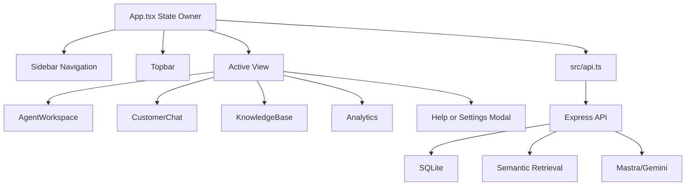

# ARIA Frontend Architecture

This document explains the React frontend used by ARIA, including the screen structure, component responsibilities, state flow, API integration, and final-demo talking points.

## Frontend Purpose

The frontend is the user-facing layer of ARIA. It provides a working support dashboard where:

- A support agent can review conversations and AI suggestions.
- A customer can ask questions and submit feedback.
- Knowledge records can be viewed and added.
- Analytics can show feedback, quality, source strength, and learning signals.
- Help and Settings modals provide demo support and live system status.

The frontend does not directly access SQLite, Gemini, or Mastra. It communicates with the Express backend through `src/api.ts`.

## Technology Stack

| Area | Technology | Purpose |
| --- | --- | --- |
| Framework | React | Component-based UI rendering |
| Language | TypeScript | Typed props, data models, and API responses |
| Build Tool | Vite | Local development server and production build |
| Icons | Lucide React | Navigation, controls, status indicators, and visual cues |
| Charts | Recharts | Analytics charts and dashboard visualizations |
| Styling | CSS | Application shell, responsive layout, cards, tables, modal, and fixed navigation |

## Current Project Structure

```text
src/
|-- App.tsx
|-- App.css
|-- api.ts
|-- constants.ts
|-- main.tsx
|-- types.ts
|-- components/
    |-- AgentWorkspace/
    |   |-- AgentWorkspace.tsx
    |   |-- AIPanel.tsx
    |   |-- ChatPanel.tsx
    |   |-- ConversationList.tsx
    |   |-- index.ts
    |-- Analytics/
    |   |-- Analytics.tsx
    |   |-- ChartsSection.tsx
    |   |-- InsightsSection.tsx
    |   |-- LearningSources.tsx
    |   |-- MetricStrip.tsx
    |   |-- index.ts
    |-- Common/
    |   |-- Message.tsx
    |   |-- Metric.tsx
    |   |-- Source.tsx
    |   |-- index.ts
    |-- CustomerChat/
    |   |-- ChatHistory.tsx
    |   |-- CustomerChat.tsx
    |   |-- FeedbackPrompt.tsx
    |   |-- index.ts
    |-- KnowledgeBase/
    |   |-- KnowledgeBase.tsx
    |   |-- KnowledgeSummary.tsx
    |   |-- KnowledgeTable.tsx
    |   |-- index.ts
    |-- Layout/
        |-- AppModal.tsx
        |-- Sidebar.tsx
        |-- Topbar.tsx
        |-- index.ts
```

## Application Shell

The frontend uses a fixed application shell:

- `Sidebar` remains fixed on the left for navigation.
- `Topbar` remains fixed at the top of the content area.
- `main-content` is the scrollable region where each screen changes.

This improves demo usability because the user always sees the ARIA brand, navigation, search, notification icon, and current screen title while moving through long dashboard content.

## Main State Owner

`App.tsx` is the top-level state coordinator. It manages:

- Active view: agent workspace, customer chat, knowledge, or analytics.
- Active modal: Help or Settings.
- Selected agent conversation.
- AI suggestion text and action status.
- Customer chat messages and input.
- Customer feedback state.
- Knowledge records loaded from the backend.
- Analytics summary loaded from the backend.
- Live system status loaded from `/api/system-status`.

The app keeps state management simple by using React state and typed props. A global store such as Redux or Zustand is not needed for the current project size.

## Views And Components

| View | Main Component | Purpose |
| --- | --- | --- |
| Agent Workspace | `AgentWorkspace` | Allows an agent to inspect a conversation, view an AI suggestion, and accept, edit, regenerate, or reject it. |
| Customer Chat | `CustomerChat` | Allows a customer to ask questions, receive grounded answers, see source evidence, and provide rating feedback. |
| Knowledge | `KnowledgeBase` | Displays support knowledge records and allows new records to be added. |
| Analytics | `Analytics` | Shows support performance, feedback learning, topic trends, and source quality. |
| Help Modal | `AppModal` | Provides a guided demo flow for presentation. |
| Settings Modal | `AppModal` | Shows live backend, database, retrieval, Mastra, and learning-loop status. |

## Agent Workspace

The Agent Workspace is the support-agent screen.

| Component | Responsibility |
| --- | --- |
| `AgentWorkspace` | Arranges the three-column agent layout. |
| `ConversationList` | Displays seeded support conversations with status and priority. |
| `ChatPanel` | Shows the active customer conversation. |
| `AIPanel` | Shows the editable AI suggestion and action buttons. |

Important actions:

- `accepted` stores a positive agent action.
- `edited` stores a corrected response.
- `rejected` stores a rejection signal.
- Regenerate updates the suggestion text locally for demo flow.

Backend connection:

- Agent actions are sent to `POST /api/agent-actions`.
- Analytics is refreshed after an action is saved.

## Customer Chat

The Customer Chat screen demonstrates the customer-facing AI support flow.

| Component | Responsibility |
| --- | --- |
| `CustomerChat` | Coordinates chat, live support status, source count, and feedback panel. |
| `ChatHistory` | Renders user and assistant messages, source chips, confidence, retrieval method, and generation provider. |
| `FeedbackPrompt` | Collects 1-5 star feedback for the latest assistant response. |

Important behavior:

- A customer question is sent to `POST /api/chat`.
- The backend creates or continues a conversation.
- The assistant response includes confidence, sources, source scores, retrieval method, and generation provider.
- Feedback is sent to `POST /api/feedback`.
- The UI resets rating state after a new customer message.

Demo proof:

- Ask a refund, product damage, billing, or delivery question.
- Confirm the response shows source evidence.
- Submit a rating and explain that the feedback is persisted for learning analytics.

## Knowledge Base

The Knowledge screen presents the support knowledge used for grounded responses.

| Component | Responsibility |
| --- | --- |
| `KnowledgeBase` | Handles search query, add-knowledge form, and view composition. |
| `KnowledgeTable` | Displays knowledge records, category, status, uses, and updated date. |
| `KnowledgeSummary` | Shows indexed-source and usage summary. |

Backend connection:

- Existing records are loaded from `GET /api/knowledge`.
- New records are added through `POST /api/knowledge`.

Current project behavior:

- The UI can add records.
- Existing semantic embeddings are used by retrieval.
- If knowledge content changes significantly, `npm run index:knowledge` should be run to refresh embeddings.

## Analytics

The Analytics screen turns stored records into visible project evidence.

| Component | Responsibility |
| --- | --- |
| `Analytics` | Main analytics dashboard container. |
| `MetricStrip` | Shows average rating, learning sources, AI acceptance rate, and source quality. |
| `ChartsSection` | Shows response quality trend and top support topics. |
| `LearningSources` | Shows strong learning signals and review-needed sources. |
| `InsightsSection` | Summarizes impact and review guidance. |

Backend connection:

- Analytics data is loaded from `GET /api/analytics/summary`.
- Metrics are calculated from persisted conversations, feedback, source quality, and agent actions.

Demo proof:

- After customer feedback or an agent action, analytics can be refreshed to show that records are being tracked.
- The dashboard is not only static UI; it is connected to the backend summary endpoint.

## Help And Settings Modals

`AppModal.tsx` handles both Help and Settings.

Help mode:

- Provides a recommended demo flow.
- Guides the presenter through customer query, AI response, agent action, feedback learning, and analytics evidence.

Settings mode:

- Reads `/api/system-status`.
- Shows live status for backend API, SQLite database, semantic retrieval, Mastra/Gemini configuration, and learning sources.
- Does not expose API keys; it only displays whether the provider is configured.

This is useful in viva because it proves the frontend can read live backend status and is not only displaying hard-coded labels.

## API Client

`src/api.ts` centralizes frontend-backend communication.

| Function | Endpoint | Used By |
| --- | --- | --- |
| `api.chat` | `POST /chat` | Customer Chat |
| `api.submitFeedback` | `POST /feedback` | FeedbackPrompt |
| `api.submitAgentAction` | `POST /agent-actions` | AIPanel |
| `api.getKnowledge` | `GET /knowledge` | KnowledgeBase, startup loading |
| `api.addKnowledge` | `POST /knowledge` | KnowledgeBase |
| `api.getAnalytics` | `GET /analytics/summary` | Analytics, feedback/action refresh |
| `api.getSystemStatus` | `GET /system-status` | Settings modal |

The API base URL is:

```text
VITE_API_URL=http://localhost:8787/api
```

If `VITE_API_URL` is not set, the frontend defaults to:

```text
http://localhost:8787/api
```

## Frontend Data Flow



## Type Safety

`src/types.ts` defines shared frontend types such as:

- `View`
- `Conversation`
- `KnowledgeItem`
- `NewKnowledgeItem`
- `ChatMessage`
- `SourceScore`
- `AnalyticsSummary`
- `LearningSignals`
- `LearningSource`
- `SystemStatus`

These types reduce mistakes when passing props, rendering API responses, and updating shared state.

## Error And Loading Behavior

The frontend includes simple but useful resilience:

- Customer chat shows loading state while waiting for an assistant response.
- Chat errors are shown when the API request fails.
- Feedback submission has its own loading state.
- Agent actions show a saving state.
- Startup data loading uses independent results, so if one endpoint fails, other available data can still render.
- Settings status refreshes when the Settings modal opens.

## UI And UX Decisions

- The interface is a real application shell, not a landing page.
- Navigation is always visible.
- The main content area scrolls independently.
- Repeated sections use cards and tables for scannability.
- Icons are used for navigation, status, and compact controls.
- Dark mode was intentionally removed to keep the final UI stable and consistent.
- The design is focused on support operations: agent workspace, customer chat, knowledge management, and analytics.

## Frontend Verification Checklist

| Check | Expected Result |
| --- | --- |
| Open app at `http://localhost:5173` | Sidebar, topbar, and default Agent Workspace render correctly. |
| Switch navigation views | Agent Workspace, Customer Chat, Knowledge, and Analytics open without layout issues. |
| Customer sends a valid question | User message appears, assistant response appears, source chips and confidence render. |
| Customer submits feedback | Feedback state updates and backend accepts the rating. |
| Agent accepts/edits/rejects suggestion | Status changes and action is saved to backend. |
| Knowledge page loads records | Table shows persisted knowledge records. |
| Add knowledge record | New record appears in UI after backend save. |
| Analytics opens | KPI cards, charts, learning signals, and review sections render. |
| Help modal opens | Demo flow guidance appears. |
| Settings modal opens | Live backend/database/retrieval/Mastra status appears. |
| Production build | `npm run build` completes successfully. |
| Linting | `npm run lint` completes successfully. |

## Demo Explanation Points

- The frontend is split into modular React components instead of one large file.
- `App.tsx` coordinates view state and backend data.
- `src/api.ts` is the only frontend layer that talks to the backend.
- Customer Chat proves the end-user AI support flow.
- Agent Workspace proves human-in-the-loop review and feedback capture.
- Knowledge Base proves source management and grounding data.
- Analytics proves stored feedback is converted into measurable learning signals.
- Settings proves the UI can display live system status from the backend.
- The frontend is typed with TypeScript to reduce integration mistakes.

## Future Enhancements

These are useful future improvements, but they are not required for the final academic demo:

- Add login authentication and role-based access.
- Add pagination and filters for large conversation/knowledge datasets.
- Add toast notifications for saved actions and errors.
- Add frontend unit tests for key components.
- Add end-to-end UI tests with Playwright.
- Add React Query or SWR if data refresh patterns become more complex.
- Add export buttons for analytics and reports.
