# ARIA System Workflows

This document explains how the main ARIA workflows move through the React frontend, Express backend, SQLite database, semantic retrieval layer, feedback learning loop, and optional Mastra/Gemini integration.

## High-Level System Workflow

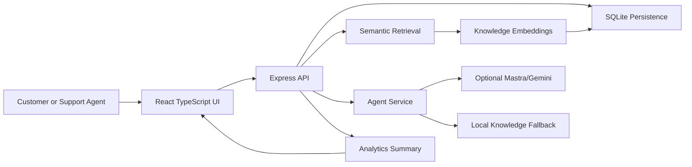

The frontend remains provider-neutral. It only calls the ARIA backend API. This allows the same UI to work with local fallback responses, local Mastra server mode, or a future Mastra Cloud endpoint.

## Customer Chat Workflow

The customer chat workflow allows a customer to ask a support question and receive a grounded AI response with confidence, retrieval method, provider status, and knowledge-source evidence.

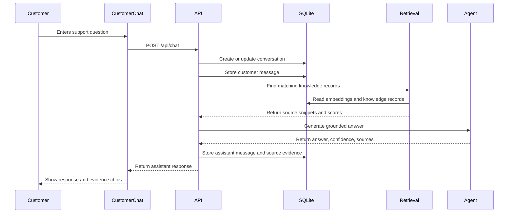

Implementation points:

| Step | Implementation |
| --- | --- |
| User submits message | `sendCustomerMessage()` in `src/App.tsx` |
| Frontend API call | `api.chat()` in `src/api.ts` |
| Backend endpoint | `POST /api/chat` in `server/index.ts` |
| Conversation persistence | `conversations` table |
| Message persistence | `messages` table |
| Knowledge grounding | semantic retrieval with keyword fallback |
| Response evidence | confidence, sources, source scores, retrieval method, provider |

## Customer Feedback Workflow

After receiving a response, the customer can submit a star rating. ARIA stores this rating and uses it for analytics and adaptive learning.

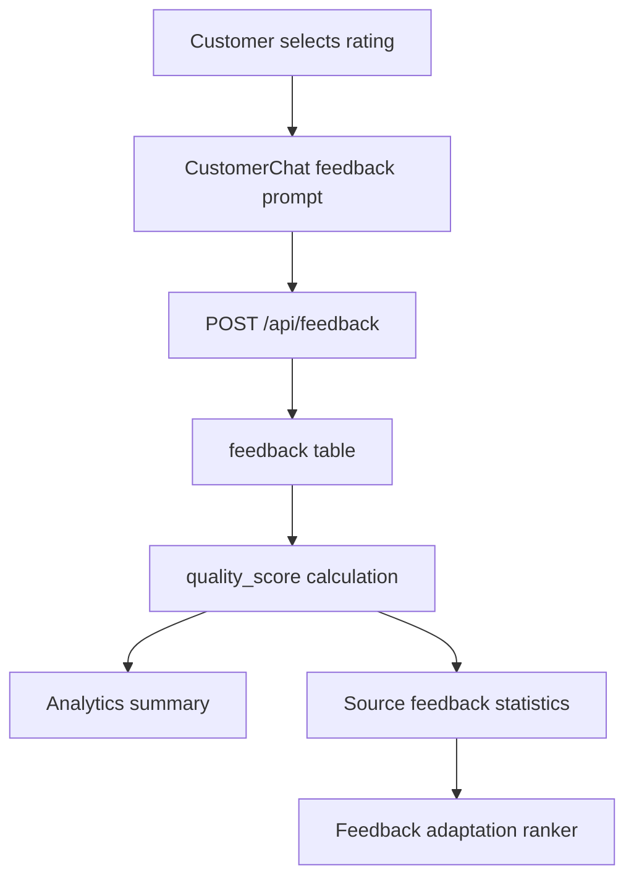

Implementation points:

| Step | Implementation |
| --- | --- |
| Customer selects stars | `FeedbackPrompt` component |
| Feedback submit | `submitCustomerFeedback()` in `src/App.tsx` |
| Frontend API call | `api.submitFeedback()` |
| Backend endpoint | `POST /api/feedback` |
| Persistence | `feedback` table |
| Analytics refresh | `api.getAnalytics()` after feedback submit |

The feedback record is connected to both the conversation and the assistant message. This connection lets the system identify which knowledge source received positive or negative feedback.

## Agent Workspace Workflow

The Agent Workspace represents the support-agent side. The agent can review AI suggestions, edit them, accept them, regenerate them, or reject them.

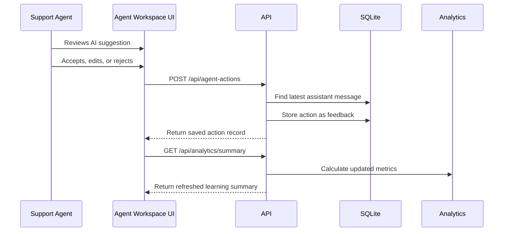

Implementation points:

| Step | Implementation |
| --- | --- |
| Agent action button | `AIPanel` component |
| Action handler | `submitAgentAction()` in `src/App.tsx` |
| Frontend API call | `api.submitAgentAction()` |
| Backend endpoint | `POST /api/agent-actions` |
| Persistence | `feedback` table with `accepted`, `edited`, or `rejected` |
| Analytics update | refreshed after action is saved |

Agent actions are treated as learning signals:

- `accepted` increases quality confidence.
- `edited` indicates useful but imperfect AI output.
- `rejected` indicates poor or unsafe output.

## Knowledge Base Workflow

The Knowledge Base stores support policies, FAQs, and procedures used for grounded responses.

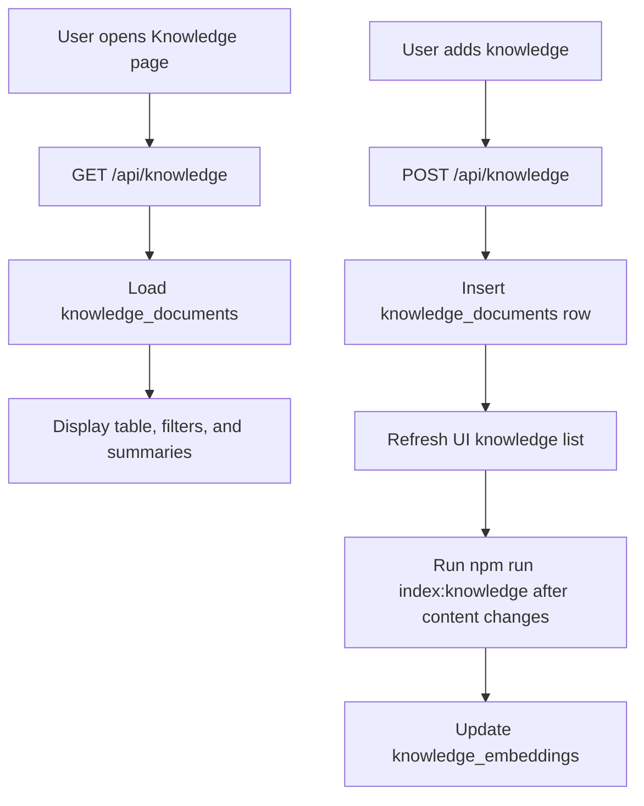

Implementation points:

| Step | Implementation |
| --- | --- |
| Initial load | `api.getKnowledge()` in `src/App.tsx` |
| Knowledge list endpoint | `GET /api/knowledge` |
| Add knowledge form | `KnowledgeBase` component |
| Add knowledge handler | `addKnowledge()` in `src/App.tsx` |
| Add endpoint | `POST /api/knowledge` |
| Knowledge persistence | `knowledge_documents` table |
| Embedding persistence | `knowledge_embeddings` table after indexing |

Important note:

After adding or editing knowledge content, embeddings should be refreshed with:

```powershell
npm run index:knowledge
```

## Semantic Retrieval Workflow

Semantic retrieval helps ARIA find relevant knowledge even when the customer uses different wording from the stored knowledge text.

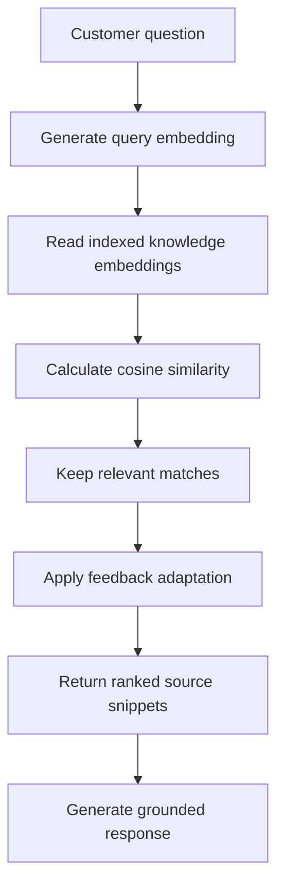

If semantic retrieval fails because the embedding runtime is unavailable, ARIA automatically uses keyword retrieval.

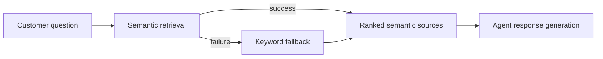

Key behavior:

| Area | Behavior |
| --- | --- |
| Primary retrieval | Semantic vector search |
| Fallback retrieval | Keyword search |
| Embedding model | `Xenova/all-MiniLM-L6-v2` |
| Stored dimensions | 384 |
| Source ranking | semantic similarity plus bounded feedback adjustment |
| Safe unrelated handling | no source and escalation flag when no support source matches |

## Feedback Adaptation Workflow

ARIA does not simply store feedback for display. Feedback becomes a bounded learning signal that can adjust source ranking for future responses.

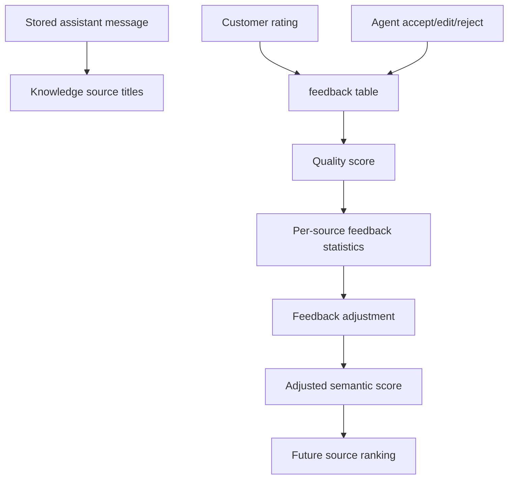

Formula:

```text
adjusted score = semantic similarity + feedback adjustment
```

Safety limits:

| Setting | Value | Purpose |
| --- | --- | --- |
| Neutral quality | `60` | Baseline when no strong feedback exists. |
| Prior strength | `5` | Reduces overreaction to one or two feedback records. |
| Maximum adjustment | `+/- 0.03` | Prevents feedback from overriding clearly better semantic matches. |

This makes the system adaptive but controlled.

## Analytics Workflow

The Analytics page converts persisted operational data into support and learning metrics.

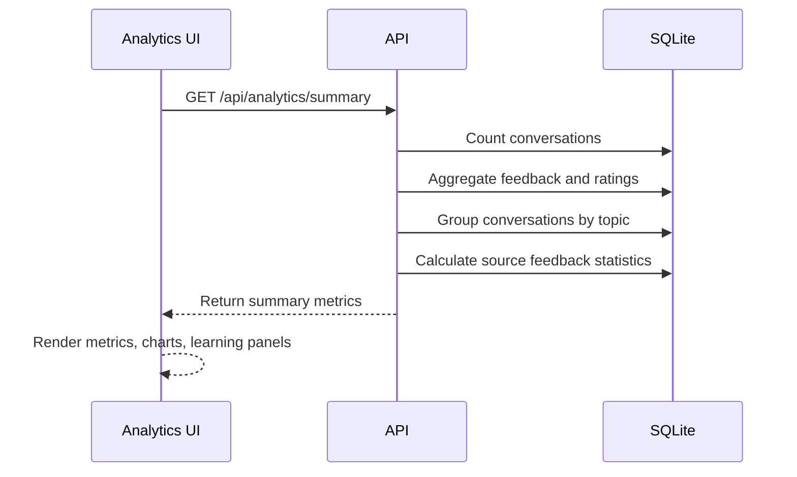

Metrics displayed:

| Metric | Source |
| --- | --- |
| Average rating | `feedback.rating` |
| Average quality | `feedback.quality_score` |
| AI acceptance rate | accepted feedback records |
| Correction rate | edited feedback records |
| Topic distribution | `conversations.topic` |
| Learned source count | feedback-adjusted knowledge sources |
| Strongest sources | high-quality feedback statistics |
| Review-needed sources | low-quality, edited, or rejected sources |

## Mastra/Gemini Workflow

ARIA is designed so the backend can switch response generation providers without changing the frontend.

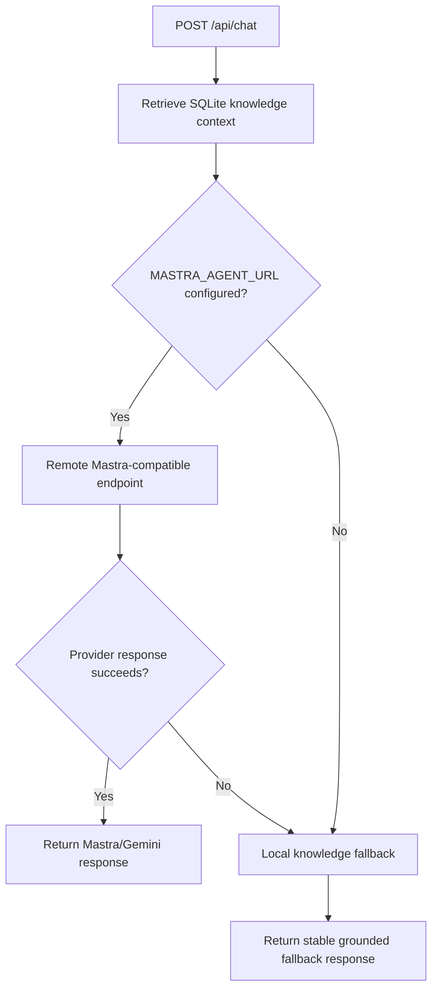

This is important for demo reliability:

- If Gemini or Mastra is available, ARIA can produce live AI responses.
- If quota, credits, or provider availability becomes an issue, ARIA still returns grounded local responses.
- The UI continues to work because it only depends on the Express API contract.

## Help and Settings Workflow

The sidebar Help and Settings buttons are lightweight demo-support workflows.

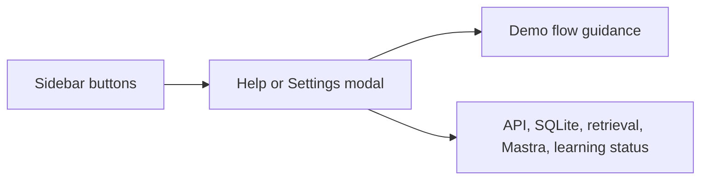

These modals help during presentation because they summarize system readiness without requiring the evaluator to inspect code.

## Theme and Layout Workflow

ARIA includes a fixed dashboard shell and persistent light/dark mode.

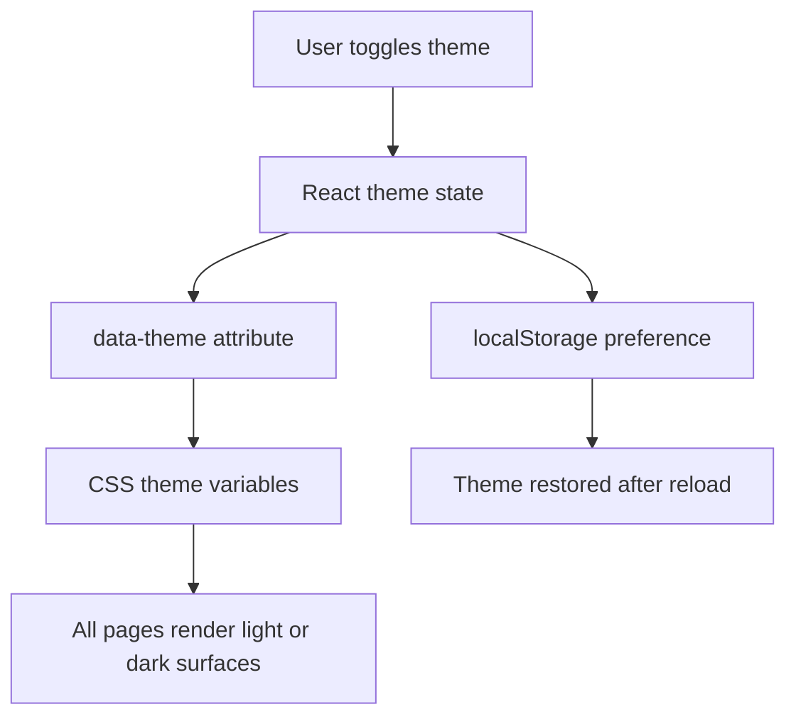

Layout behavior:

- The left sidebar remains fixed.
- The top horizontal bar remains fixed.
- Only the main content area scrolls.
- Navigation resets the main content area to the top.
- Desktop and mobile layouts avoid page-level horizontal overflow.

## Final Demo Workflow

Recommended final demo flow:

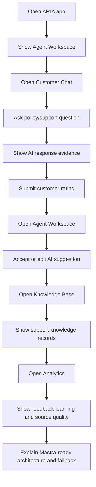

Suggested demo question:

```text
How long does a refund take after approval?
```

Expected behavior:

- ARIA returns a grounded refund response.
- Source evidence includes `Refund and return policy`.
- Retrieval method is semantic when embeddings are indexed.
- Customer feedback can be saved.
- Agent action can be saved.
- Analytics updates from persisted records.

## Final Report Explanation

This workflow can be explained in the final report as:

> ARIA follows a modular workflow where the React frontend sends customer and agent actions to an Express backend. The backend stores all conversations, messages, feedback, knowledge records, and embeddings in SQLite. During chat generation, the backend retrieves relevant support knowledge using semantic vector search with keyword fallback, then generates a grounded response through either Mastra/Gemini or a local fallback agent. Customer ratings and agent actions are stored as feedback and converted into quality scores. These scores are used in analytics and in a bounded feedback adaptation algorithm that can improve future source ranking without overriding semantic relevance.

## Validation Coverage

The workflows are validated by:

| Command | Coverage |
| --- | --- |
| `npm run lint` | TypeScript/React code quality. |
| `npm run build` | Production frontend build. |
| `npm run validate:final` | API health, chat, feedback, agent actions, analytics, escalation. |
| `npm run evaluate:retrieval` | Semantic retrieval and unrelated-query rejection. |
| `npm run evaluate:adaptation` | Feedback adaptation safety and bounded influence. |

These validation commands should be run before final screenshots, final report submission, and demo rehearsal.
