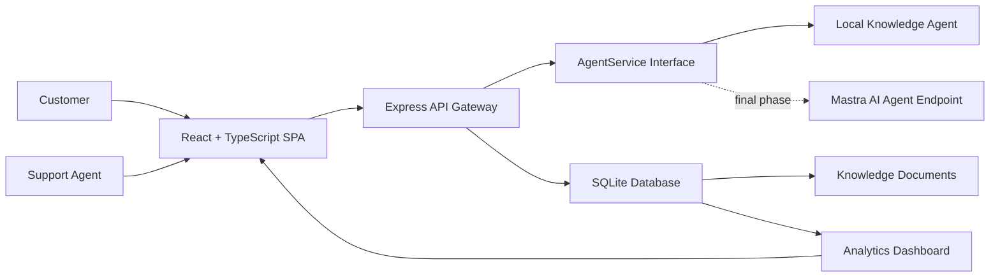
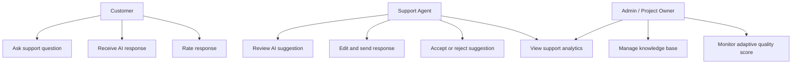
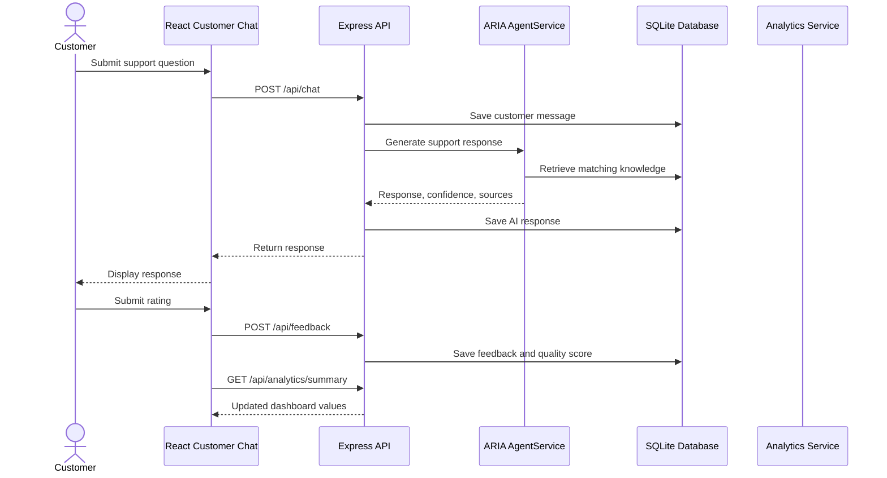
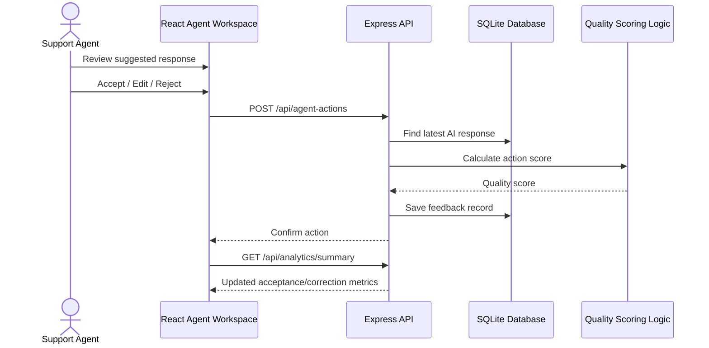
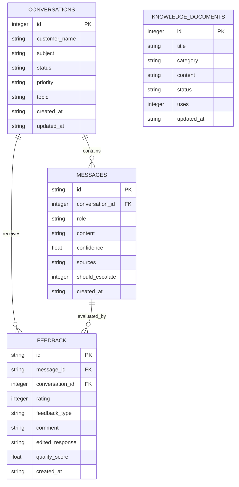
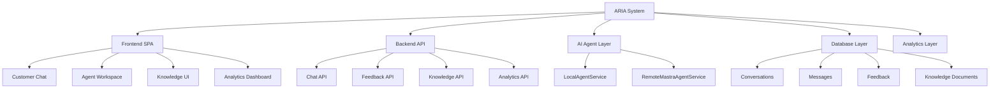

# ARIA Interim Diagrams

These diagrams can be copied into the interim report or converted into images.

## High-Level Architecture

## Use Case Diagram

## Customer Chat Sequence

## Agent-Assist Feedback Sequence

## ER Diagram

## Module Decomposition

