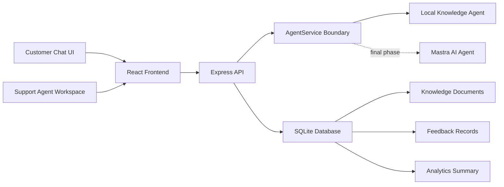
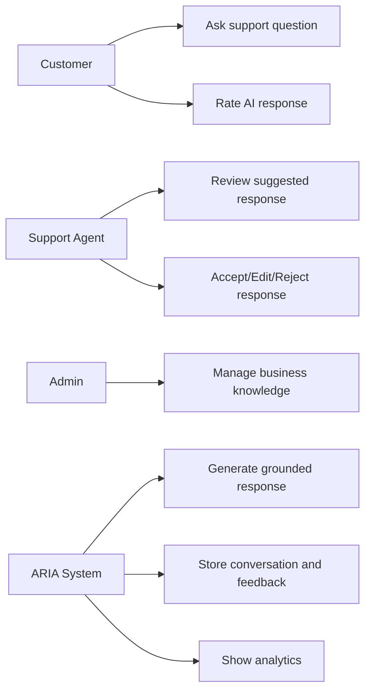
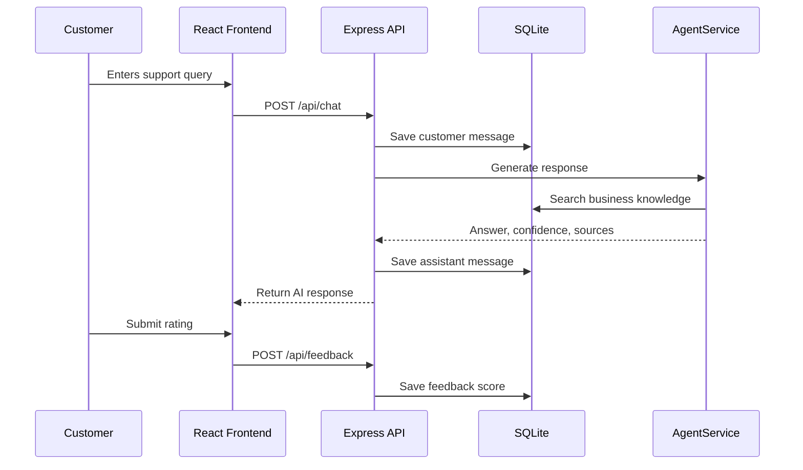
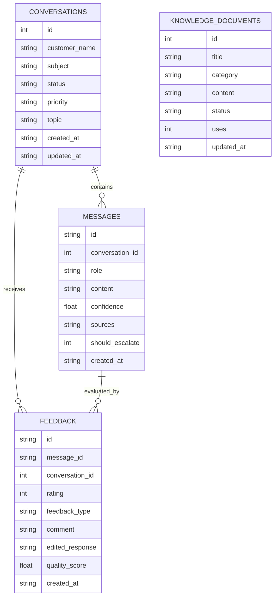

# ARIA High-Level Design

## System Overview

ARIA is designed as an adaptive customer-support assistant. The frontend gives support agents and customers a usable interface, while the backend stores conversations, retrieves business knowledge, generates AI-assisted responses, records feedback, and computes analytics.

## Architecture Diagram

## Use Case Diagram

## Sequence Diagram

## ER Diagram

## Module Decomposition

- Frontend shell: navigation, top bar, and view routing.
- Agent workspace: conversation queue, AI suggestion panel, and agent feedback actions.
- Customer chat: customer query input, AI response rendering, and rating capture.
- Knowledge base: indexed business documents and create-knowledge workflow.
- Analytics: conversation count, rating, quality, acceptance, correction, and topic metrics.
- Express API: REST endpoints for chat, feedback, knowledge, analytics, and health.
- Database layer: SQLite schema, seed data, retrieval helpers, and quality scoring.
- AI service layer: local knowledge-backed fallback and Mastra-compatible remote adapter.

## Core Algorithms

### Topic Inference

1. Convert the customer message to lowercase.
2. Check for known support keywords such as refund, password, delivery, product, and billing.
3. Assign a topic label.
4. Store the topic against the conversation for analytics.

### Knowledge Retrieval

1. Tokenize the customer query into searchable terms.
2. Compare terms against each knowledge document title, category, and content.
3. Apply higher scores for title matches, medium scores for category matches, and lower scores for content matches.
4. Return the top matching documents.
5. Attach retrieved document titles as response sources.

### Quality Scoring

1. Convert customer rating to a 0-100 score.
2. Add a positive adjustment for accepted responses.
3. Add a negative adjustment for rejected responses.
4. Clamp the final score between 0 and 100.
5. Use average quality score in analytics.
